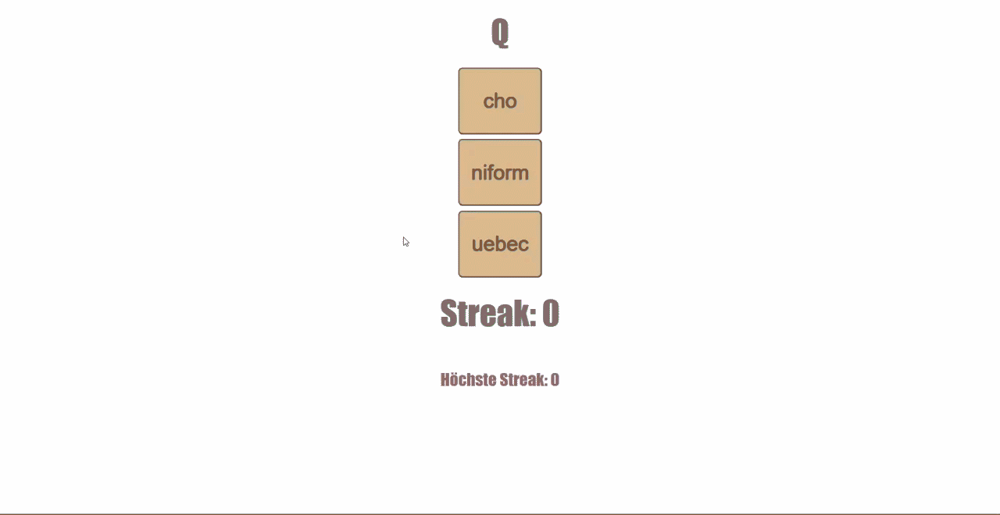

# NATO-Alphabet

## [im Browser öffnen →](https://schwanniii.github.io/NATO-Alphabet/)

  

 

## Beschreibung

* **Vokabeln** Lerne das NATO-Alphabet wie durch Vokabeln.
* **visuelles Feedback:** Richtig / Falsch wird direkt als Hintergrundfarbe angezeigt.
* **Streaks:** Baue durch richtige Antworten eine Streak auf. 
* **höchste Streak:** Deine höchste Streak wird für deinen Browser gespeichert.
  
  ---

## Feedback

[Fehler melden](https://github.com/schwanniii/NATO-Alphabet/issues) - [Feature vorschlagen](https://github.com/schwanniii/NATO-Alphabet/issues)

